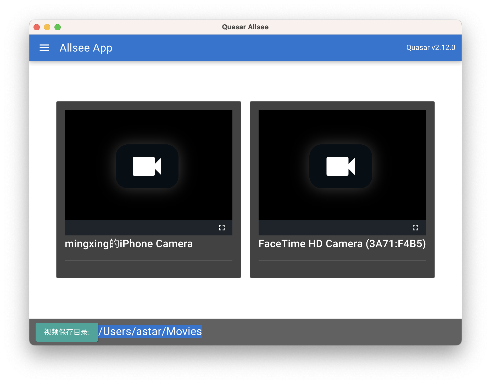

# Quasar Allsee (quasar-all-see-js)

Camera recorder for multi USB devices



## Install the dependencies
```bash
yarn
# or
npm install
```

### Start the app in development mode (hot-code reloading, error reporting, etc.)
```bash
quasar dev
```


### Lint the files
```bash
yarn lint
# or
npm run lint
```


### Build the app for production
```bash
quasar build -m electron -d
```

### Publish the app for production

changeset with:

```bash
npx changeset version
```

```bash
quasar build -m electron -P always
```

### Customize the configuration
See [Configuring quasar.config.js](https://v2.quasar.dev/quasar-cli-webpack/quasar-config-js).

### based on

- https://github.com/hawkeye64/electron-quasar-file-explorer-v2
- https://github.com/muaz-khan/RecordRTC
- https://github.com/muaz-khan/DetectRTC
- https://github.com/streamproc/MediaStreamRecorder
- https://github.com/collab-project/videojs-record

> others
- https://github.com/muaz-khan/WebRTC-Experiment
